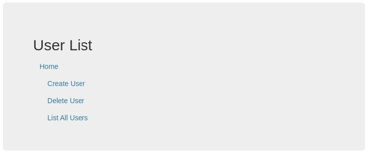

# Flask App with Database

This is a flask app is more like a template than a real app.

IT was built under the premise that you have some users that you want to get to fill out a form and have their details logged to a database to be recalled later.

You can repurpose this to store booking dates, inventory/stock keeping, or anything you like really.
<br>

## Homepage



You can add and delete users using the webpages.
<br>

## Database Structure

The database in this repo was created using the [create_database.py](./database/create_database.py)

If you need to add columns to it you can delete the current one and generate a new one by adding the columns you need here

```python
class User(db.Model):
    id = db.Column(db.Integer, primary_key=True)
    name = db.Column(db.String(100))
    dob = db.Column(db.String(100))
```

You can also change the name of the class to better reflect your use case and the data you are storing.
<br>